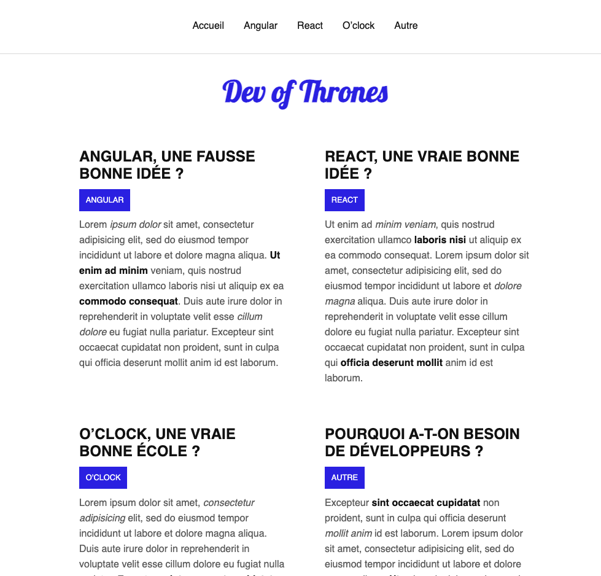

#  💻 Dev Blog React

## Create a blog page with React.

## Illustration

## Language/tools
- HTML5
- CSS3/SCSS
- Javascript/REACT/Hook/useState/useEffect
- Webpack
- PropTypes
- axios / API

## Goals 
- Discover React (web page usage)
- Modularize the code using components
- React Router
- Get data through API

## Status
Project not completed

## Context
Project carried out during my training as a web developer
